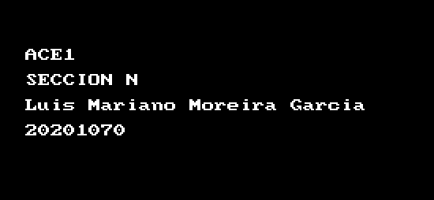
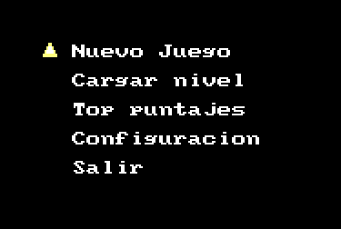
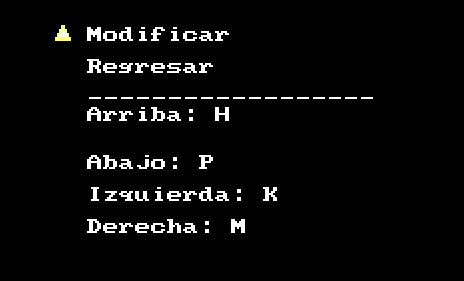
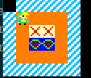

# MANUAL DE USUARIO

## DESCRIPCIÓN DEL PROGRAMA

Programa capaz de ejecutar el videojuego sokoban hecho en assembler

## USO DEL Programa

### Inicio del programa

Al iniciar el programa tendremos el mensaje con los datos del desarrollador: 

### Inicio y configuracion

Si selecciona con f1 la configuracion, podra alterar los siguientes valores: 

Se podra mover a traves del mapa respecto a las teclas que haya puesto (predeterminadamente estan las flechas). 

